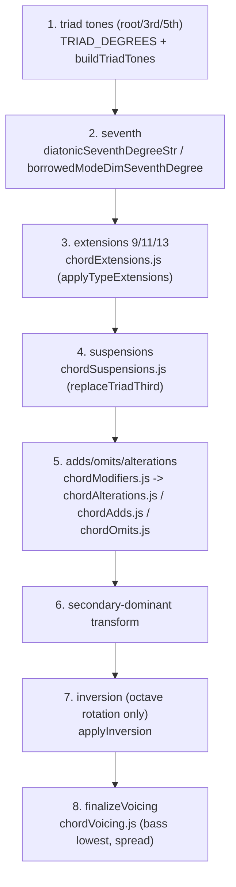

# 04 — Find the hardest failures and fix the engine

This is the core reverse-engineering loop. You will: rank failing buckets, dump per-chord truth-vs-engine pitch diffs, dedupe to a few unique root causes, locate the responsible engine function, make a surgical edit, and re-measure.

## Step 1 — Rank the failures

From [`03_build_database.md`](03_build_database.md), read `SUMMARY.md` (worst buckets first) and run `testModification.js --failing`. Buckets are properties: `type=7`, `inversion=3`, `alterations=b5`, `borrowed=locrian`, `type=9 omit=3&5`, etc. The worst-and-largest buckets are where fixing one root cause clears many chords.

## Step 2 — Dump per-signature diffs (`diffSignature.cjs`)

`_Debug_testing/diffSignature.cjs` reads the built DB (no scraping) and prints `truthPcs` vs `engPcs` for engine failures, grouped or filtered:

```bash
# summary: count of engine failures per chord "signature"
node _Debug_testing/diffSignature.cjs

# rows matching ALL tokens (type/inv/applied/bor/sus/alt/add/omit)
node _Debug_testing/diffSignature.cjs type=7 inv=3
node _Debug_testing/diffSignature.cjs "omit=3&5" --limit 8
node _Debug_testing/diffSignature.cjs bor=locrian

# options
node _Debug_testing/diffSignature.cjs alt=b5 --all          # include harness/piano failures too
node _Debug_testing/diffSignature.cjs --db chord_db_corpus2 type=9   # different corpus DB
```

Each row shows `truthRoman` / `engRoman`, both PC sets, both bass PCs, and the full `chord` JSON + `key`. That is everything you need to reason about one chord. (On Windows PowerShell, quote tokens containing `&`.)

## Step 3 — Dedupe to root causes

Hundreds of failing chords usually collapse to a handful of bugs. The signature summary makes this obvious — e.g. all `bor=locrian` failures share one wrong-seventh cause; all `type=9 omit=3&5` share one collapsed-maj7 cause. **Fix the cause, not the instance.** Also separate out single-song outliers (one weird piece can dominate a bucket) and unimplemented features (tritone substitutions, `substitutions:["tri"]`) — those are deferrals, not fixes.

## Step 4 — Locate the engine locus

Notes are built in `web-player/lib/music.js` (`rootToDiatonicTriad` for diatonic/borrowed, `buildChordFromNoteName` for applied), in this **pipeline order**. Inversion only rotates octaves — so a wrong *pitch class* comes from construction, not from `applyInversion`.



| Symptom | Most likely locus |
|---------|-------------------|
| Wrong 3rd/5th quality (maj vs min, dim vs perfect) | triad quality in `rootToDiatonicTriad` / `scaleChordQualities` (`scales.js`) |
| Wrong 7th (b7 vs maj7 vs dim7) | seventh selection in `music.js` (`diatonicSeventhDegreeStr`, `borrowedModeDimSeventhDegree`, the `omitTriad35` branch) |
| `b5`/`#5` not altering the real 5th, or corrupting the 7th | `chordAlterations.js` (`applyAlterations`) |
| Missing/extra 9/11/13 tones, phantom `(b9)(b13)` | `chordExtensions.js` + the half-dim enrichment in `music.js`/`engineRun.js` |
| sus notes wrong | `chordSuspensions.js` |
| Right notes, wrong bass / `orderOk` fails | `applyInversion` / `finalizeVoicing` |
| Symbol wrong but notes right (`romanExact` only) | `jsonToSymbol.js` (does not affect `notesOk`) |
| `engPcs: null` / throw | remote/theoretical keys → `getNoteLabel`/`getAbsoluteOctave` (`music.js`), `generateScaleLabels` (`scales.js`) |

Before editing, **read `DECODE_FIX_LOG.md`** — many past bugs were field-semantics issues, and there is a do-not-reapply list (see [`05_validate_and_log.md`](05_validate_and_log.md)).

## Step 5 — Make a surgical edit

Change only the cited branch. No file rewrites. Keep the existing behavior for cases that already pass — narrow your condition so you only affect the failing signature.

## Step 6 — Re-measure

```bash
# fast: rerun just the touched bucket against truth (no scraping)
node _Decode_oracle/testModification.js bor=locrian --rerun --db-dir _Decode_oracle/chord_db_corpus4

# authoritative: rebuild the whole DB and recheck
node _Decode_oracle/buildChordDb.js --corpus _Decode_oracle/corpus4.json --db-dir _Decode_oracle/chord_db_corpus4
node _Debug_testing/diffSignature.cjs    # confirm the engine-failure count dropped
```

Then run the regression gates in [`05_validate_and_log.md`](05_validate_and_log.md) before moving on.

---

## Worked example (Fix 036d — locrian `iø7`)

1. **Diff:** `node _Debug_testing/diffSignature.cjs bor=locrian` showed `iø7(loc)` truth `[1,4,7,10]` vs eng `[1,5,7,10]` / `[…]+b7` across multiple songs — a shared pattern, not a one-off.
2. **Reason:** `[1,4,7,10]` is a full diminished 7th (`bb7`); the engine built a half-dim (`b7`). Hooktheory labels several mode sevenths `ø` but voices a dim7 — a pattern already handled for dorian°6 / lydian°4 / minor°2 / phrygian°5 in `borrowedModeDimSeventhDegree`.
3. **Locus:** that function in `web-player/lib/music.js` simply lacked the locrian degree-1 case.
4. **Edit:** add `if (scale === "locrian" && chordRootSD === 1) return "bb7";`.
5. **Re-measure:** rebuild → engine failures dropped, no bucket regressed.
6. **Log:** appended as Fix 036d to `DECODE_FIX_LOG.md`.

Other Fix 036 causes followed the same loop: maj7 collapsing under `omit=3&5` (seventh selection), `ø(b5)` not rendering a dim7 (`chordAlterations.js`), `#5` on borrowed dim sevenths (seventh selection), and `engPcs:null` in theoretical keys (label/octave fallbacks in `music.js` + `scales.js`).
