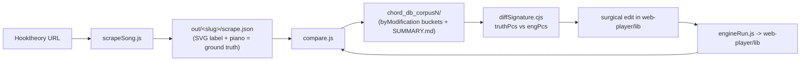
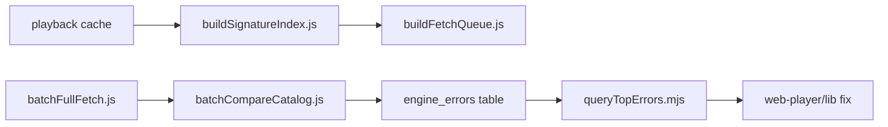

# Oracle Guide — Hooktheory chord decode engine

**This directory is the single source of truth** for the chord-decode reverse-engineering workflow. If you are a new agent with zero prior context, read these files in order and you can reproduce the entire loop: download ground-truth song data, build the comparison database, find where the engine is wrong, fix it, and validate without regressions.

## Mission (3 sentences)

Hooktheory TheoryTab pages encode each song's chords as JSON (`root`, `type`, `borrowed`, `inversion`, `alterations`, …). Our web-player engine (`web-player/lib/`) turns that JSON into actual piano notes + a Roman numeral symbol. **The job: make the engine's notes match the pitch classes and bass that Hooktheory actually renders** — measured as `notesOk` ≥ 99% across closed-loop corpora.

## Mental model

The "ground truth" is what Hooktheory's website *renders* for a chord (the SVG chord label, and an optional piano-roll), **not** the raw JSON. The JSON is often incomplete, so we scrape the rendered label, infer its pitch-class set, and compare that to what the engine produces from the same JSON. A mismatch is either an **engine bug** (fix the code) or a **harness/scrape artifact** (do not chase).

## Read order

1. [`01_setup.md`](01_setup.md) — install Node + puppeteer, repo layout, conventions.
2. [`02_get_ground_truth.md`](02_get_ground_truth.md) — discover songs, build a unique corpus, scrape ground truth.
3. [`03_build_database.md`](03_build_database.md) — build the chord DB, understand its layout and `notesOk`.
4. [`04_find_and_fix.md`](04_find_and_fix.md) — find the hardest failures and fix the engine surgically.
5. [`05_validate_and_log.md`](05_validate_and_log.md) — regression gates and how to log your work.
6. [`reference.md`](reference.md) — command cheat sheet, JSON field semantics, glossary, open issues.

## Repo / harness map

| Area | Path | Role |
|------|------|------|
| Theory engine | `web-player/lib/music.js` | `chordInterpreter`, applied/borrowed paths, inversions |
| Symbol builder | `web-player/lib/jsonToSymbol.js` | Roman + letter name from JSON |
| Scales | `web-player/lib/scales.js` | Key + borrowed scale intervals/qualities |
| Modifier modules | `web-player/lib/chord{Suspensions,Omits,Adds,Alterations,Extensions,Modifiers,NoteUtils}.js` | Post-triad note pipeline |
| Oracle harness | `_Decode_oracle/` | Scrape, compare, report, chord DB |
| Decode scraper | `_Decode_oracle/scrapeSong.js` | Rich scrape (SVG truth + JSON + screenshots) |
| Debug scripts | `_Debug_testing/` | e.g. `diffSignature.cjs` (truth-vs-engine PC diff) |
| Research scripts | `_Research_testing/` | URL discovery, corpus backfill/status |
| Catalog error loop | `_Research_testing/hooktheory_catalog/cli/` | 34k-song signature index, fetch queue, `engine_errors` SQL table |
| Fix history | `_Decode_oracle/DECODE_FIX_LOG.md` | Append-only numbered fix log (read in order) |
| Deferred failures | `_Decode_oracle/REMAINING_FAILURES.md` | Known non-engine / deferred issues |

## Current status (update after corpus-wide changes)

| Corpus | File | Songs (in DB) | Chords | notesOk | DB path |
|--------|------|---------------|--------|---------|---------|
| 1 | `corpus.json` | ~33 | ~1538 | ~99.2% | `chord_db/` |
| 2 | `corpus2.json` | 52 | 2451 | **99.9%** | `chord_db_corpus2/` |
| 3 | `corpus3.json` | 195 | 7416 | **99.6%** | `chord_db_corpus3/` |
| 4 | `corpus4.json` | 500 | 14603 | **98.5%** | `chord_db_corpus4/` |

**Bar:** ≥99% `notesOk` per corpus. **Latest work:** Fix 036 (corpus4 hardest-property fixes) — see [`DECODE_FIX_LOG.md`](../_Decode_oracle/DECODE_FIX_LOG.md).

## Catalog-scale error loop (34k songs)

The Hooktheory catalog (`sacred_ring_data/catalog/hooktheory_catalog.db`) holds ~39k songs; most are **light-harvested** (API JSON only). Oracle ground truth still requires **full Fetch** (SVG `rendered[]`). This workflow distills failures locally and fetches the minimum song set to cover high-frequency chord signatures.

| Step | Command |
|------|---------|
| 1. Index chord signatures (local) | `node _Research_testing/hooktheory_catalog/cli/buildSignatureIndex.js` |
| 2. Seed compare + build fetch queue | `node _Research_testing/hooktheory_catalog/cli/buildFetchQueue.js` |
| 3. Full Fetch (rate-limited) | `node _Research_testing/hooktheory_catalog/cli/runFetchDaemon.js --wave-size 20` |
| 3b. Watch for fix-ready waves (parallel terminal) | `node _Debug_testing/watchFetchWaves.mjs` |
| 4. Compare → SQL error catalog | `node _Research_testing/hooktheory_catalog/cli/batchCompareCatalog.js --wave <id> --resync` |
| 5. AI-ready fix brief | `node _Debug_testing/queryTopErrors.mjs --limit 20` |
| 6. Diff by signature (SQL) | `node _Debug_testing/diffSignature.cjs --sql type=7 inv=3` |

**Parallel fix workflow:** Each fetch wave compares slugs immediately and writes `ready_for_fix` to `sacred_ring_data/catalog/fetch_waves.json`. Run `watchFetchWaves.mjs` in a second terminal — it emits `top_errors_<wave>.md` when a wave completes while fetching continues. Touch `.fetch_pause_for_fix` to pause the fetch daemon during engine edits; delete to resume.

## Golden rules (full list in 05 + reference)

- Ground truth = the rendered label, not the JSON. Merge SVG modifiers when JSON is incomplete.
- Always classify a failure as **engine** vs **harness/piano_noise** before touching code.
- All engine edits are **surgical** — localized to the cited function. Never rewrite a file.
- Use `--db-dir` so you operate on the right corpus DB; never clobber `chord_db/` by accident.
- Append every code fix to `DECODE_FIX_LOG.md` and refresh the status table above.
- Debug scripts go in `_Debug_testing/`, research scripts in `_Research_testing/`; keep files ≤400 lines.
