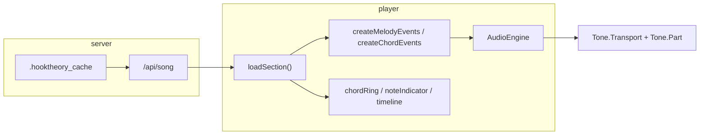

# Architecture

## Repository layout

```
3_sacred_ring/
├── web-player/           # Browser player (main app)
│   ├── player.js         # Orchestration, event scheduling, transport
│   ├── audio/engine.js   # Tone.js synths and Tone.Part scheduling
│   ├── components/       # UI: controls, chordRing, noteIndicator, timeline
│   ├── lib/              # Music theory: chords, scales, voicing
│   └── server.js         # Static server + song API
├── .hooktheory_cache/    # Cached section JSON per song
├── _Decode_oracle/       # Chord oracle / corpus validation pipeline
└── documentation/        # Project docs (this directory)
```

## Web player data flow



1. **Load** — `loadSection()` fetches section JSON, parses key, builds tick-based event arrays, calls `engine.setupTransport()` and schedules parts.
2. **Schedule** — Melody and chord events are sorted by tick; chord events use a tiebreaker (`release` → `arpeggio` → `attack`) for same-tick ordering.
3. **Play** — `Tone.Transport` drives `Tone.Part` callbacks, which trigger the appropriate synth.
4. **UI sync** — `onTrigger` callbacks and `setupProgressTracking()` update the ring and indicators from transport position.

## Audio engine (`web-player/audio/engine.js`)

| Component | Type | Purpose |
|-----------|------|---------|
| `melodySynth` | `Tone.Synth` | Melody attack/release pairs |
| `chordSynth` | `Tone.PolySynth` | Simultaneous chord tones (block mode) |
| `arpeggioSynth` | `Tone.Synth` | Sequential chord tones (arpeggio mode) |
| `previewSynth` | `Tone.PolySynth` | Click-to-preview chords (no transport) |

Lifecycle helpers: `play()`, `pause()`, `stop()`, `releaseAllNotes()`, `rescheduleParts()`, `cancelAllParts()`.

## Event types (chords)

| `type` | Synth | Description |
|--------|-------|-------------|
| `attack` | `chordSynth` | All chord notes on |
| `release` | `chordSynth` | All chord notes off |
| `arpeggio` | `arpeggioSynth` | Single note `triggerAttackRelease(note, durationSec, time)` |

## Timing

- **BPM** from section metadata; user can scale via tempo slider.
- **Arpeggio speed** is specified in milliseconds and converted to ticks at the current BPM so real-time spacing stays constant when tempo changes.
- **Ticks per beat:** 192 (`startTick = (beat - 1) * 192`).

## Server (`web-player/server.js`)

Node HTTP server: serves static assets from `web-player/`, builds song library from `.hooktheory_cache` directory structure, exposes song JSON by relative path.
