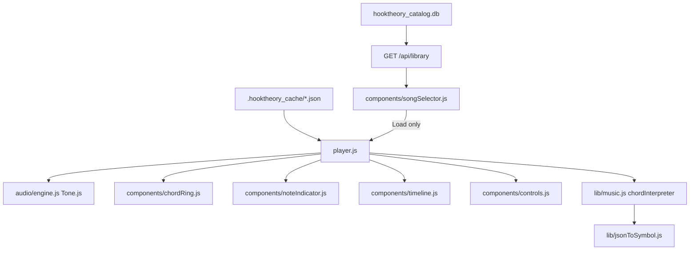
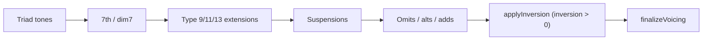

# Architecture

Reverse-engineers Hooktheory TheoryTab chord JSON into correct piano voicings + Roman symbols, validates with a closed-loop oracle, and plays it back in a browser web-player.

Two halves:
- **`web-player/`** — runtime engine + UI that turns chord JSON into audio + visuals.
- **`_Decode_oracle/`** — offline harness that scrapes Hooktheory ground truth, runs the engine, and scores correctness per chord.

---

## 1. Repo / worktree / branch layout

| Worktree | Path | Checked-out branch |
|---|---|---|
| Primary | `H:/Desktop/3_sacred_ring` | `main` |
| Agent worktree | `C:/Users/user1/.cursor/worktrees/3_sacred_ring/g12x` | feature branches |

A branch checked out in one worktree cannot be checked out or deleted from another (git refuses). To delete a feature branch from the agent worktree, detach HEAD first (`git checkout --detach`).

Branch history relevant to this work:
- `oracle/chord-db-suspensions-truth` — feature branch for the entire closed-loop oracle effort (Fixes 015–035). Merged to `main` (`f99829a`), then deleted.
- `feat-root-checkbox` — root-position checkbox feature (`050360f`). Merged to `main` (`9e2bff0`).

Naming of `oracle/chord-db-suspensions-truth`: **chord-db** = bucketed regression DB, **suspensions** = early `chordSuspensions.js` milestone, **truth** = SVG/piano ground truth. Largely historical once merged.

---

## 2. Web-player runtime

Entry: [`web-player/player.js`](../web-player/player.js) wires components + audio engine. Served by [`web-player/server.js`](../web-player/server.js) from `.hooktheory_cache/` and the Hooktheory catalog DB.



**Song Selector:** browsing shows metadata; chord ring/timeline update when a **pipeline-complete** song is opened (auto-load) or when **Load** is clicked for incomplete songs. `POST /api/library/load` returns the cache folder key; `player.js` resolves it via `GET /api/songs`.

**Add by URL:** search view has a TheoryTab URL field. `POST /api/library/add` upserts the row, runs **Fetch** (one browser pass), then parallel local **metadata + processed** (no oracle).

**Unified harvest:** one Puppeteer session per song writes `_Decode_oracle/out/<slug>/scrape.json` (page SongMetrics + per-section API json + SVG + piano). **Fetch** is the only button that launches the browser. **metadata**, **processed**, and **tested** are local transforms over that artifact (`runLocalsParallel` — `Promise.all` + `worker_threads` for oracle compare).

**Pipeline buttons:** **catalogued** (read-only) · **Fetch** (harvest) · **metadata** / **processed** / **tested** (local; gated until harvested). Red = run; green hold ~800ms = clear that step only. Oracle **tested** keeps `scrape.json` on clear (report files removed).

Backend: `harvest.js`, `harvestArtifact.js`, `metadataFromHarvest.js`, `processedFromHarvest.js`, `runLocalsParallel.js`, `oracleCompareWorker.js`, `pipelineOps.js`, `pipelineJobs.js`, `addSongPipeline.js`; HTTP: `web/pipelineApi.js`, `web/addSongApi.js`. Frontend: `songSelectorPipeline.js`, `pipelineHold.js`.

Key state lives in `player.js`: `currentRawChords`, `currentKey`, `currentChordEvents`, `isArpeggiated`, `forceRootPosition`. Chord/melody events are tick-based (192 PPQ) so tempo changes reschedule cleanly via `engine.rescheduleParts` / `updatePlaybackSettings`.

### Components

| File | Role |
|---|---|
| `components/controls.js` | Play/seek/tempo, melody+chord volume, arpeggiate toggle/speed; section picker (song dropdown hidden — load via Song Selector) |
| `components/chordRing.js` | Circular chord visualizer; manual chord preview on click; transition table; `ResizeObserver` keeps canvas sharp on layout changes. Applied chords use split metadata: `placementDegree` (geometry in current key) vs `colorDegree` (always original `root` for node/tooltip/transition colors). |
| `components/noteIndicator.js` | "Now Playing" Melody + Chord cards (note pills, scale-degree pills, Roman symbol via `romanNumeralToHtml`, pronunciation block, borrowed tag, root-position checkbox) |
| `components/timeline.js` | Beat-axis timeline; click-to-preview chords; song URL display |
| `components/songSelector.js` | Left-panel catalog browser: add-by-URL, playable dropdown, light-catalog modal, pipeline buttons, auto-load when pipeline complete |
| `components/songSelectorPipeline.js` | Pipeline button HTML, hold-to-clear wiring, oracle error-rate tables |
| `components/pipelineHold.js` | 800ms hold-to-clear with progress bar on green pipeline buttons |

---

## 3. Chord engine + voicing pipeline

`chordInterpreter(chord, key, opts)` in [`web-player/lib/music.js`](../web-player/lib/music.js) is the single entry for JSON-chord → notes.

Voicing is built in a fixed order; **modifiers run before inversion**:



- Modifier modules: `chord{Suspensions,Omits,Alterations,Adds,Extensions,Modifiers}.js` define *which* pitch classes exist.
- Inversion only changes *order + octave placement*.
- [`lib/chordVoicing.js`](../web-player/lib/chordVoicing.js) `finalizeVoicing`: for `inversion === 0`, pitch-ascending sort; dim7 chords get spread voicing (3rd/5th lifted an octave).

### Two inversion code paths
| Path | Function | Notes |
|---|---|---|
| Diatonic / borrowed | `rootToDiatonicTriad` → `applyInversion()` | rotate + bump ex-bass up an octave |
| Applied / letter-built | `buildChordFromNoteName()` inversion block | bass down an octave, upper voices collapsed to a target octave |

Because octave choices differ per path, you **cannot reverse** an already-inverted note array — you must re-run the interpreter with `inversion: 0`.

### Hooktheory JSON semantics
- `root` = scale degree in active (or borrowed) key; it is the **denominator** when `applied > 0`.
- `applied` = numerator degree of a secondary chord; tonicization target = note at degree `root`, treated as major.
- `borrowed` = mode name (`minor`/`dorian`/.../`locrian`) or a custom interval array.
- `inversion` 0–3; figured-bass slash symbols are derived from it in `jsonToSymbol.js`.

Roman/letter symbols are built independently in [`lib/jsonToSymbol.js`](../web-player/lib/jsonToSymbol.js) (`getChordSymbol`, `getChordLetterName`) — they read `chord.inversion` directly, so they are independent of playback voicing.

**Display** (figured-bass stacks, °/ø quality glyphs, HTML + canvas): [`lib/romanNumeralCanvas.js`](../web-player/lib/romanNumeralCanvas.js) — see [ROMAN_NUMERALS.md](./ROMAN_NUMERALS.md).

**Pronunciation** (spoken readings): [`lib/romanNumeralSpeak.js`](../web-player/lib/romanNumeralSpeak.js) — see [PRONUNCIATION.md](./PRONUNCIATION.md).

### Chord ring placement semantics
- Non-applied chords: node radius/angle placement follows `root`.
- Applied chords (`applied` 1..7): node placement is computed by resolving the applied chord root note in the current key and mapping that note back to a scale degree (`placementDegree`).
- Color is intentionally decoupled from placement: node color, tooltip scale-degree color chip, and transition table colors stay tied to original `root` (`colorDegree`), even when the node is drawn on another radius.
- Closed-loop verification fixture: `_Research_testing/gustySecondaryDominantRingClosedLoopTest.mjs` with outputs in `_Research_testing/gustySecondaryDominantRingClosedLoop{Report,Table}.(json|md)` for Gusty Garden Galaxy.

---

## 4. Root-position feature

Goal: a "Root position" checkbox in the Chord card that re-voices all chords to root position for **display, preview, playback, and arpeggiate**, while leaving Roman symbols as written (e.g. still `V⁴³`).

Implementation (merged `050360f`):
- `chordInterpreter(chord, key, { forceRootPosition })` — when set, interprets a shallow clone with `inversion: 0`. ([`lib/music.js`](../web-player/lib/music.js))
- `noteIndicator.js` — checkbox in the Chord `.card`, `onRootPositionChange(checked)` callback, `setRootPositionChecked()` sync.
- `player.js` — `forceRootPosition` state + `interpretChord()` wrapper used at every call site (playback `createChordEvents`, transport `findCurrentChordAtTick`, first-chord preview, timeline click); toggle triggers `updatePlaybackSettings()` to rebuild + reschedule.
- `chordRing.js` — `getForceRootPosition` getter passed in so ring-click previews honor the flag.

No oracle/DB impact: it is a player voicing preference only. Verified on Maple Leaf Rag (e.g. `inv 2/3 type 7` → bass `Bb3`/`Db4` becomes root `Eb3` with pitch-ascending stack).

---

## 5. Decode oracle (closed loop)

```
Hooktheory URL
  → scrapeSong.js            (SVG truth + JSON + screenshots)
  → svgTruth.js              (parse rendered chord labels)
  → engineRun.js             (dynamic import of web-player/lib/music.js)
  → compare.js               (align truth vs engine, pcsExact / notesOk / orderOk)
  → report.json / matrices
  → buildChordDb.js          → chord_db*/ (bucketed regression DB)
  → testModification.js      (per-bucket pass rates; --db-dir per corpus)
```

**Scale-degree pills (`degreesOk`):** separate from `notesOk`. `notesOk` checks pitch-class sets + bass against Hooktheory truth; `degreesOk` checks that each UI scale-degree pill label matches its paired note's pitch class in the song key (`web-player/lib/scaleDegreeVerifier.js`, wired in `engineRun.js` → `compare.js` → `report.js`). CLI regression: `npm run test:scale-degrees` (fixtures) and `npm run test:scale-degrees:corpus` (quick `chord_db` batch). Dev assert: add `?verifyDegrees=1` to the player URL to log mismatches in `noteIndicator.js`.

Ground-truth hierarchy: (1) rendered SVG labels, (2) letter-inferred PC sets (`truthNotes.js`), (3) piano DOM scrape when it agrees (`pianoNotes.js`). Incomplete JSON is enriched with SVG letter modifiers.

Failure classes: **engine** (note-gen bug), **harness** (alignment / truth-parser), **piano_noise** (piano scrape vs engine edge disagreement).

Key harness files: `compare.js`, `truthNotes.js`, `truthLetterParse.js`, `chordRootPc.js`, `svgTruth.js`, `engineRun.js`.

### Corpora
| Corpus | DB dir | Config |
|---|---|---|
| 1 | `_Decode_oracle/chord_db/` | `corpus.json` |
| 2 | `_Decode_oracle/chord_db_corpus2/` | `corpus2.json` |
| 3 | `_Decode_oracle/chord_db_corpus3/` | `corpus3.json` |

Rebuild: `node _Decode_oracle/buildChordDb.js --corpus _Decode_oracle/corpusN.json --db-dir _Decode_oracle/chord_db_corpusN`.

---

## 6. Closed-loop results this cycle (Fixes 034–035)

Outcome: **0 engine failures across all corpora.** Most former "engine" failures were harness `orderOk` false-negatives.

| Corpus | Chords | notesOk | Fail (eng/har/piano) |
|---|---:|---:|---|
| 1 | 1538 | 99.2% | 12 (0 / 10 / 2) |
| 2 | 2347 | **100.0%** | 0 |
| 3 | 6740 | 99.8% | 14 (0 / 11 / 3) |

### Fix 034 — PC-order gate + Summertime engine
- `truthNotes.checkNoteOrder`: compare **pitch-class ascending** order for all piano-validated pairs (piano scrape is staff-order with voice crossings, e.g. Clocks `Bb3,Eb4,G3` vs engine `Eb3,G3,Bb3` — same PCs). Cleared ~46 misclassified failures.
- `music.js`: locrian `applied===target` shortcut gated to `chordType < 7` (Summertime beat 9 `V7/bV(loc)`); removed bogus `hm + borrowed=minor + root=1 → V7/iv` redirect (beat 17 `i7(min)`).

### Fix 035 — repeat-condensed alignment (subagent)
- `svgTruth.js`: split collapsed (`y=0`) strips by fill color — `#ffffff` roman, `#dae0e6` letter (fixes Zombie `VII6` + `D/F#`).
- `compare.js`: `alignByRootPc()` for repeat-condensed sections (`ratio < 0.8`); generalized `leadingJsonSkipCount()` (skip ≤3 leading JSON chords) — fixes Zombie 1↔16 and Bruno Mars repeat-prefix.

### Deferred (see [`_Decode_oracle/REMAINING_FAILURES.md`](../_Decode_oracle/REMAINING_FAILURES.md))
- Penny Lane Verse (×10): analyst Roman on SVG vs figured-bass JSON (`I△42`/`vi7` dual representation); needs figured-bass-aware alignment.
- Waterloo Bridge/41: `iiiø4(add13)2` compound figured-bass parse.
- Piano noise (3): god-only-knows `#iø7(bor)` b5 bleed; whitney `iø7(loc)` bb7 vs natural 5.

Fix-by-fix detail: [`_Decode_oracle/DECODE_FIX_LOG.md`](../_Decode_oracle/DECODE_FIX_LOG.md). Agent onboarding: [`_Decode_oracle/AGENT_WORK_RECORD.md`](../_Decode_oracle/AGENT_WORK_RECORD.md).

---

## 7. Hooktheory cache + unified library

Song data is cached under `.hooktheory_cache/<artist> - <Song_Title>/` by [`extract_hooktheory_data.js`](../extract_hooktheory_data.js) via `lib/cache/cacheManager.js`. One JSON per section plus `_metadata.json`. The web-player serves playback from here (`GET /api/songs`, `GET /api/song`).

The **catalog DB** (`_Research_testing/hooktheory_catalog/data/hooktheory_catalog.db`) is the search index for the Song Selector. Cache and catalog are joined by TheoryTab URL slug:

| `songs` column | Meaning |
|---|---|
| `cache_dir` | Folder name under `.hooktheory_cache/` (e.g. `the-beatles - Hey_Jude`) |
| `processed_at` | When section JSON was written to cache |
| `oracle_tested_at` | Oracle ground-truth compare (future) |

**Processed step:** `lib/cacheSync.js` `commitProcessedCache` sets `cache_dir` / `processed_at` on an **existing** catalog row only (no cache→DB import). Normal workflow: discover or add-by-URL → Fetch/light harvest → metadata → processed → tested.

**Working set (2026-06):** six fetch+tested songs in `.hooktheory_cache/` (see [HANDOFF.md](../HANDOFF.md)). **Planned:** move DB + cache + harvest outputs to a portable data root outside git.

| Route | Role |
|---|---|
| `GET /api/library` | All catalog rows + `playable`, `cacheKey`, pipeline `flags` |
| `GET /api/library/song?slug=` | Detail + load-gate status |
| `POST /api/library/load?slug=` | Validate gate; return `cacheKey` for player |

Download a song:
```bash
node extract_hooktheory_data.js https://www.hooktheory.com/theorytab/view/<artist>/<song>
# --newcache to bypass/refresh
node _Research_testing/hooktheory_catalog/cli/discover.js --mode quick  # discover songs into catalog
```

Library: six fetch+tested songs in cache (see HANDOFF.md). Start player: `python launch_player.py` (frees port 3000, Ctrl+C / Quit stops server).

The page scraper ([`lib/scraper/pageScraper.js`](../lib/scraper/pageScraper.js), Fix 030) discovers sections via `a.tb-section-tab` → `tab-{songId}` containers (Hooktheory removed the old `div.col-md-8` layout).

---

## 8. Conventions

- Files ≤ 400 lines; debug scripts in `_Debug_testing/`, research scripts/output in `_Research_testing/`.
- Distinguish engine vs harness failures before "fixing" voicing — check `countMatch` / `orderOk` first.
- Use `--db-dir` when testing corpus2/3 so corpus1 `chord_db/` is not overwritten.
- Log new engine/harness fixes as a numbered entry in `DECODE_FIX_LOG.md`.
- Commit only when asked. Song cache JSON is currently tracked on `main`; modularization will gitignore it — see HANDOFF.md.
